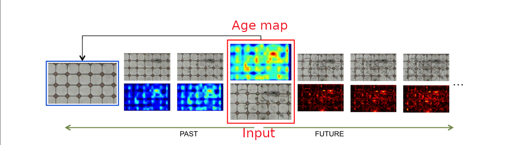

### Team: Image Imposters

# Time-varying Weathering in Texture Space 

##### Project ID: 35

##### Repo Link: https://github.com/Digital-Image-Processing-IIITH/project-image-imposters

### Team Members

- **Mohee Datta Gupta** (2018112005)
- **Mohsin Mamoon Hafiz** (2018101029)
- **Shivansh** (2018102007)
- **Srivathsan Baskaran** (2018101049)

### Main Objectives

- Given a textured input image, this project aims at producing time varying weathered and de-weathered images of the corresponding texture, estimated using prevalence analysis of texture patches.

- Also, it aims at evolving new structures as well as color variations to providing rich and natural results, through the weathering process.

- This project aims at achieving these goals without any user interaction or assistance.

### Problem Definition

Given an input image of a weathered texture, our project aims to synthesize a series of textures emulating a weathering and de-weathering pro-cesses, yielding a time-varying texture. This would be done by computing an estimated age map of the texture based on the prevalence of similar patches in the texture. Further, using this age map, an intact texture would be generated to achieve the desired results. 

To produce de-weathered textures, the age map has to be manipulated to control an interpolation of the intact texture and the input texture. Weathered textures can be synthesized by extrapolating the differences between the input texture and the intact texture.

### Expected Results

We demonstrate our technique on various textures, and their application to time-varying weathering of 3D scenes. We also extend our method to handle multi-layered textures, weathering transfer, and interactive weathering painting.

The technique creates weathered textures using non-parametric texture synthesis techniques and patch manipulations, completely oblivious to the physical weathering phenomena. We analyze a single weathered exemplar and automatically induce enough valuable information to synthesize the intact texture and an age map, which together drive the synthesis of the weathered and de-weathered textures.

### Project Milestones & Expected Timeline

| Milestone                            | Expected Dates | Duration Alloted |
| ------------------------------------ | :------------: | :--------------: |
| Paper Analysis                       |     21 Oct     |      3 days      |
| Age Map Generation                   |     25 Oct     |      4 days      |
| Tile Detection                       |     30 Oct     |      5 days      |
| **Mid Evaluation**                   |     31 Oct     |                  |
| Structured Template Generation       |     5 Nov      |      5 days      |
| Stochastic Intact Texture Generation |     10 Nov     |      5 days      |
| Weathering and De-weathering         |     15 Nov     |      5 days      |
| Results & Improvisation              |     18 Nov     |      3 days      |
| **Final Evaluation**                 |   19-25 Nov    |                  |

### Is there a dataset you need ? 

Nope!